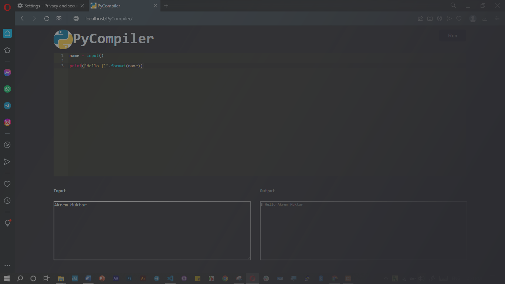

# PyCompiler
A Python Compiler web application with php and jQuery

## About me

I am alone on this project. Passionate about building great products that make people's lives easier.
My project is a simple python compiler web application. I took all responsibility for this project as I worked alone.
Choosing a topic, Designing, Code implementation,Testing
It was all my responsibility

## What Inspired me

I was always surprised by the sand_box on ALX.
When I lost the project title and got confused, I saw compiler in the project title options. Then this idea came to me. I worked on it.
So it is ALX itself that inspired him to do this project.

## Technologies

### Front-end
-> Html5
-> css
-> JavaScript(jQuery library )

### Back-end
-> php
-> JavaScript(aJax)
-> Xampp server

## Algorithm

- Get code from text editor and input from input panel.
- Saving the code as python file and input as text file in file directory.
- Compiling the python file with the text file as input
- Displaying the output.

## Challenges

The first thing that challenge me in this project research was choosing project  title. I was trying to work on many projects but i wasn't satisfied. I looked up for those titles wich given by the program. And i pick compiler. I was working with it for weeks actually it got months. I tried many ways to achieve my goal but final I got easy   ways and I done with it.
The technical challenge that i discovered on this project was how did i connect user interface with server. I was got some challenges on it. Firstly I was trying only with php but when I referring on internet I got the jQuery idea. Firstly I was using jQuery for compiler interface with some library for that was good for me to use jQuery as api so I used jQuery for it.
The pother challenge was testing it was so difficult I don’t know the reason but the compiler was so slow down and I done with it by fixing xampp server by re installing. And I got some challenge on designing user interface I choose many design but finally I work like this.
This what i got on this project.

## [Landing Page](http://alifcode.tech/PyCompiler/index.html)

## [Compiler Page](http://alifcode.tech/PyCompiler/compiler.html)